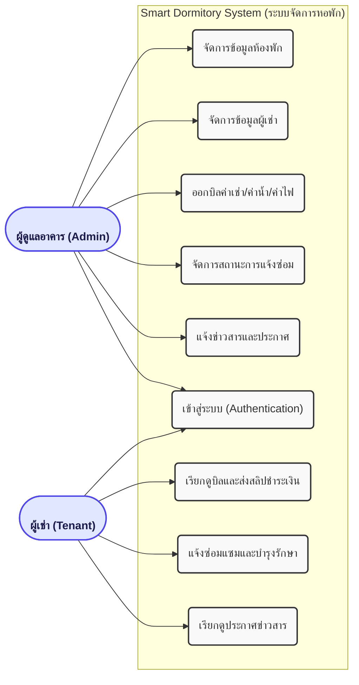
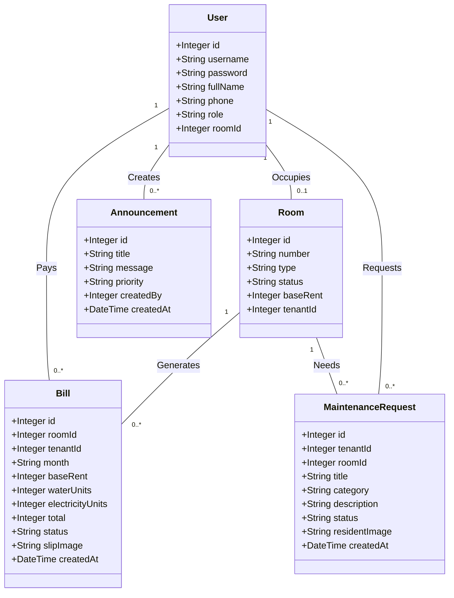
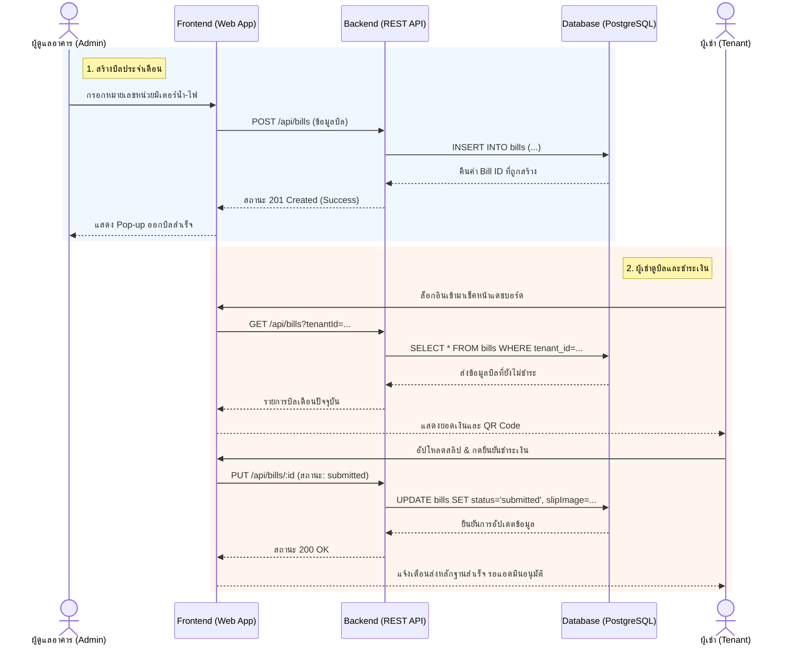

# 5.2.3 การสร้างแบบจำลองด้วย UML

เอกสารส่วนนี้รวบรวมแบบจำลอง UML ทั้ง 3 ประเภท (Use Case, Class, และ Sequence Diagram) ของระบบการจัดการหอพัก Smart Dormitory Management System ตามที่คุณต้องการครับ คุณสามารถกดย่อขยายหรือจับภาพหน้าจอ (Screenshot) เพื่อนำไปใส่ในเอกสารรายงานได้เลยครับ

## 5.2.3.1 Use Case Diagram
แสดงภาพรวมการใช้งานของระบบ โดยแยกเป็น 2 ผู้ใช้งานหลัก (Actor) คือ **ผู้ดูแลอาคาร (Admin)** และ **ผู้เช่า (Tenant)**

---

## 5.2.3.1 Class Diagram
แสดงโครงสร้างของฐานข้อมูลและความสัมพันธ์ระหว่าง Entity ต่างๆ เช่น User, Room, Bill, Maintenance, และ Announcement

---

## 5.2.3.1 Sequence Diagram
แสดงลำดับขั้นตอนการทำงาน (Workflow) ตัวอย่างของ **กระบวนการออกบิลและการชำระเงิน** ซึ่งครอบคลุมการพูดคุยตั้งแต่ส่วนแสดงผลไปยังส่วนฐานข้อมูล

